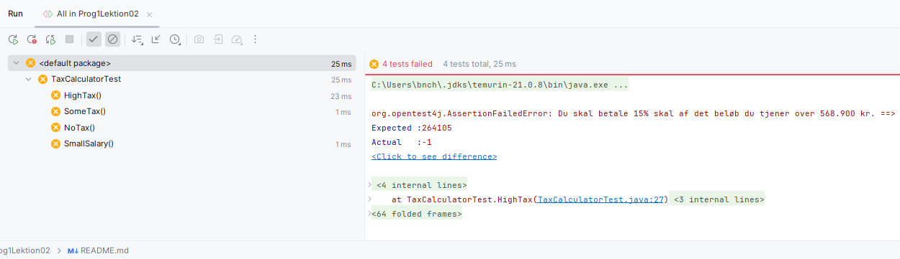

### Opgave 1 - Moms beregner

Løs følgende opgave, start med at skrive algoritmen i en kommentar.

Lav en metode hvor man kan indtaste et beløb i hele kroner og udskriv momsbeløbet.

    public class CalculateVat {
        public static void main(String[] args) {
        //Beskriv din algoritme
        }
    }

Prøv først uden at kigge i bogen kap. 2.16.

---

### Opgave 2 - Mil til kilometer konverter

Lav et program der indlæser en double fra konsollen, konverter denne til kilometer og
udskriver resultatet til konsollen.

En mil svarer til 1,6 kilometer

Eksempel output.

    Indtast antal mil: 96
    96 mil er 153,6 km.

Hvis du gerne vil udskrive en double med 1 decimal skal du bruge printf metoden.

    System.out.printf("Pi med 2 decimaler er %.2f", Math.PI); // Denne linje udskriver pi med 2 decimaler.

---

### Opgave 3 - BMI beregner

Lav et program der kan beregne BMI (Body Mass Index). Programmet skal promte brugeren for vægt og højde og derefter
udskrive BMI. BMI beregnes med formlen

$BMI = \frac{vægt}{højde*højde}$

### Opgave 4  - Skatteberegner *

Dette projekt indeholder en klasse TaxCalculator med en metode CalculateTax, tilføj din
kode til denne metode.

Ud over lidt start kode har jeg også lavet nogle tests, du kører disse tests ved at bruge short
cut, Ctrl-Shift-F10.

Disse tests fejler lige nu, men skulle gerne blive ”grønne” når du har løst
opgave.

Løs nu følgende opgave, start med at skrive algoritmen i en kommentar.

**Delopgave a)**

Lav en simpel skatteberegner hvor man kan indtaste ens månedsløn hvorefter programmet
udskriver hvor meget man skal betale i skat om måneden.

Din skatteberegner skal tage høje for personfradraget som er 48.000,- om året, som er det
beløb hvoraf der ikke skal betales skat.

Af det resterende beløb skal der betales 37% skat.

**Eksempel.**

Hvis du tjener 30.000 kr. om måneden er din årsløn *12 * 30.000 = 360.000 kr.*

Din skattepligtige indkomst er så *360.000 – 48.000 = 312.000 kr.*

Den årlige skat bliver da *312.000 * 37 / 100 = 115.440 kr.*

Og den månedlige skat er *115.440 / 12 = 9.620 kr.*

**Delopgave b)**

Udvid nu din skatteberegner, så den også beregner topskat.

Topskattegrænsen er 568.900, alt hvad du tjener over denne grænse, skal du betale topskat af. Topskatteprocenten er 15%.

**Eksempel.**

En person der tjener 600.000 om året, skal ud over at betale normal skat også betale topskat.

Det beløb der skal betales topskat af, er *600.000 – 568.900 = 31.100 kr.*

Topskattebetalingen per år er da, *15% af 31.100 = 4665 kr.*