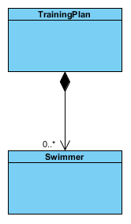

## Opgave 1

- Læs klassen SwimmerApp, så du forstår hvad der sker i denne klasse. Check at main()-metoden udskriver det forventede resultat, når du kører programmet. For hver svømmer skal den hurtigste tid udskrives.

- Læs koden for klassen TrainigPlan, så du har forstået hvad klassen gør.

- Tilføj til main()-metoden i klassen SwimmerApp to træningsplaner en der har level A og en level B. På level A er svømmeren i vandet 16 timer og styrketræner 10 timer om ugen. På level B er svømmeren i vandet 10 timer om ugen og styrketræner 6 timer om ugen.

- Du skal nu implementere associeringen mellem klasserne Swimmer og TrainingPlan givet ved nedenstående UML diagram. Hent inspiration i noten afsnit 3.


- Tilføj til main metoden i SwimmerApp den kode der skal til, for at Jan og Bo er tilknyttet planen på level 'A' og Mikkel til planen på level 'B'.

- Tilføj til klassen Swimmer metoden:

```java
/**
* Return how many training hours the swimmer has each week.
*/
public int allTrainingHours() { ... }
```

- Tilføj til klassen SwimmerApp kode der beregner og udskriver hvor mange timer om ugen svømmerne i listen træner i alt.

## Opgave 2

Opgaven her går ud på at vende navigeringen i opgave 1 om, så det nu er træningsplanen der kender deres tilknyttede svømmere.


Du skal oprette en ny folder med kopier af klasserne fra opgave 1 fjern link attributter og metoder du tilføjede i opgave 1.

- Implementer nu associeringen, givet at der kun er brug for at finde de tilknyttede svømmere ud fra træningsplanen som angivet i UML diagrammet i denne opgave.
- Lav en ny SwimmerApp klasse, som opretter to svømmere og en træningsplan og sætter svømmerne som svømmere på planen.
- Udvid SwimmingApp-klassen, så du ud fra træningsplanen finder de svømmere, som er tilknyttet planen, og udskriver informationer om hver svømmer på skærmen.

## Opgave 3

Betragt følgende klasse diagram:


- Hvad betyder det at multipliciteten er 0..* i begge retninger?
- Programmér klasserne Car og Rental, idet der er brug for at navigere fra udlejning til bil. Udskyd metoden getPrice til delopgave d).
- Lav en App klasse, som opretter 5 biler og 2 udlejninger af et antal af de fem biler.
- Programmér metoden getPrice i klassen Rental og afprøv den i Test klassen. Metoden udregner prisen for en udlejning ved at summere alle de tilhørende bilers pris pr. dag og gange med det antal dage, som udlejningen varer.

## Opgave 4

Opret en ny folder med kopier af klasserne fra opgave 2 og rette disse.



Programmer kompositionen mellem træningsplan og svømmer. Lav en afprøvklasse og prøv kompositionen af ved at lave et objekt af TrainingPlan og derefter et antal objekter af Swimmer.

- Lav kompositionen mellem Swimmer og TrainingPlan.
- Check at linkmetoderne virker ved at udskrive svømmerne på træningsplanobjektet
- Fjern en svømmer fra træningsplanen. Check igen om objekterne er knyttet rigtigt sammen.

## Opgave 5 (Ekstra opgave)

Betragt følgende klassemodel for et system til brug ved administration af tv-serier og de til serien hørende enkeltafsnit.


Klassen Series indeholder seriens titel og navne på de faste skuespillere i serien.
Klassen Episode indeholder nummeret på et afsnit i serien, afsnittets længde i minutter og navnet på gæsteskuespillerene (i hvert afsnit optræder ud over de faste skuespillere en eller flere gæsteskuespillere).

- Implementér klasserne Series og Episode uden at tage hensyn til kompositionen i diagrammet.

- Implementér kompositionen mellem Series og Episode. Du skal også tilføje en konstruktor til klassen Episode. Konstruktøren for Episode skal initialisere alle attributter i klassen.

- Programmér følgende metode tilhørende klassen Series:

```java
/**
* Return the total length (in minutes) of all the
* episodes in the series.
*/
public int totalLength()
```

- Programmér følgende metode tilhørende klassen Series:

```java
/**
* Return the total list of all guest actors from all
* episodes.
*/
public ArrayList<String> getGuestActors()
```
